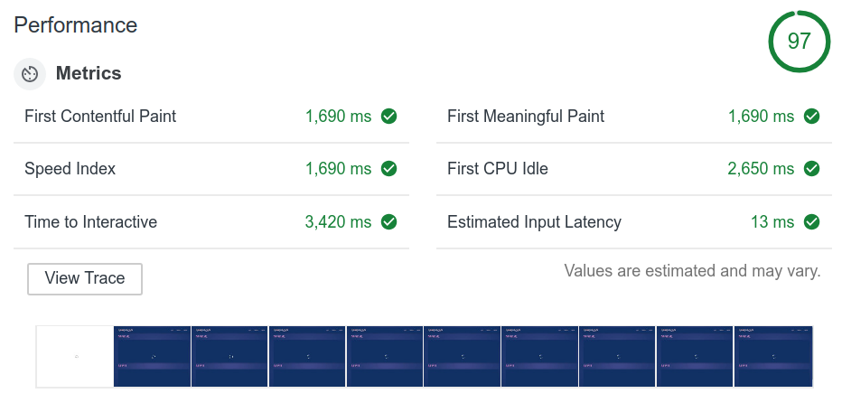
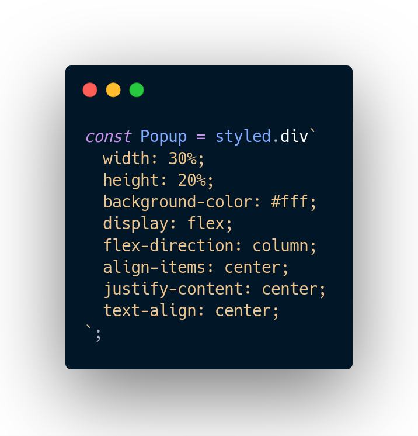

# Impulse


## Next Generation React-Redux Boilerplate

## Features

- Contains latest tools like React 16.8 (One with hooks), webpack 4, Babel 7.
- Next Generation Routing with @reach/router
- Component and Route level code-splitting with React.lazy and @reach/router
- Css-in-js with Styled Components
- No side-effect middleware, useHooks
- Out of the box support for Sass/Scss, .graphql and svgs
- Testing with Jest

## Highlights

### Webpack 4 and Babel 7

- Webpack 4 and Babel 7 provides awesome development experience with Hot-reloading, Tree-shaking, Faster Build times and all the good stuff :)

### Hardcore Code Splitting


- Split your Redux store, Views (Components and Connectors) into different chunks and show a loader even before react loads, this gives a extremely fast initial paint.

 ^^^^^ First paint contains loader :smile: ^^^^^

- Split your Routes and React components using React.lazy.

- Babel-preset-env compiles all node_modules and creates separate vendors~chunks for each our code chunk.

### Opinionated Css-in-js with Styled Components



- Styled Components provides Css-in-js support with extremely small and fast runtime.

### Next generation routing with @reach/router


- Extremely easy and intuitive routing with @reach/router

## Quick Start

```
  git clone https://github.com/kanitsharma/Impulse.git

  cd Impulse

  yarn

  yarn start
```

### Building App

```
  yarn build
```
