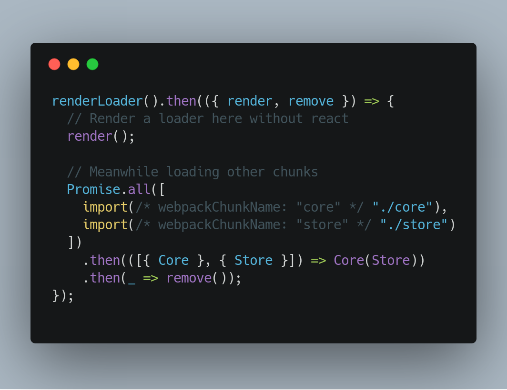
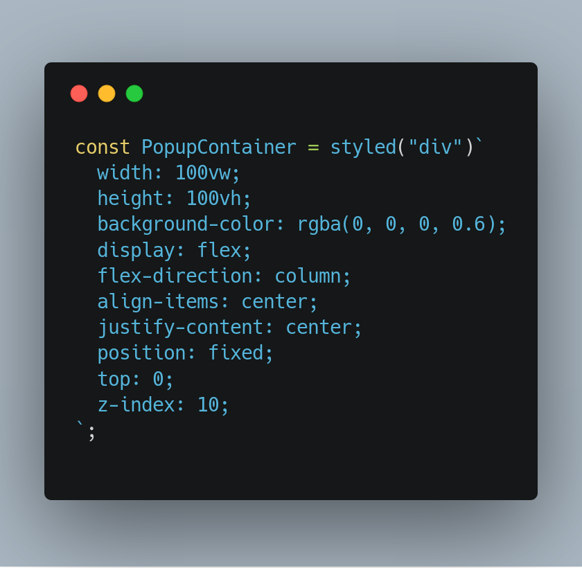
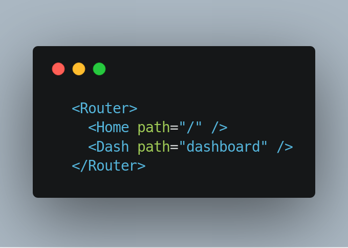
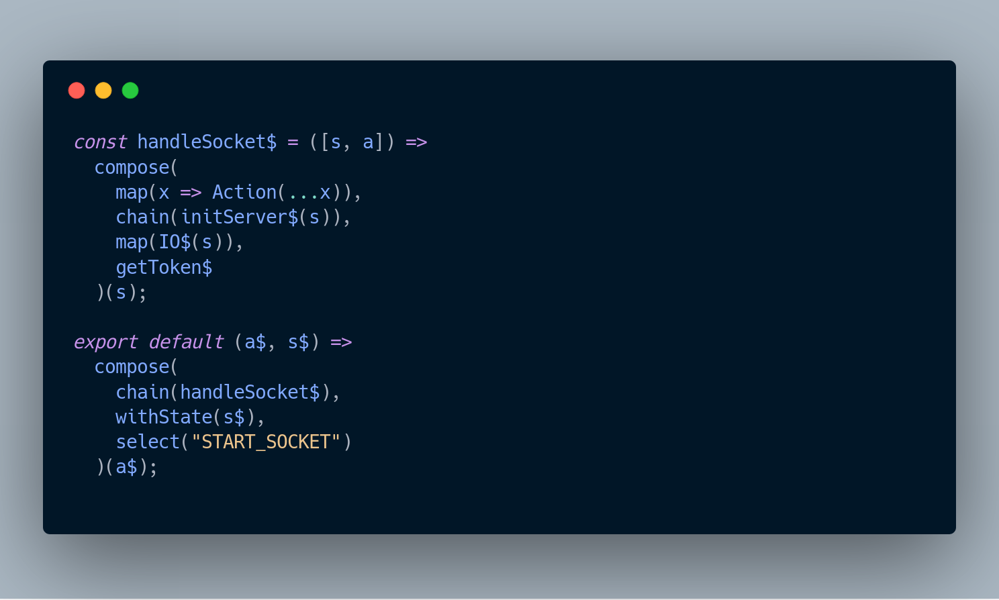

# Impulse


## Next Generation React-Redux Boilerplate

## Features

- Contains latest tools like React 16, webpack 4, Babel 7.
- Next Generation Routing with @reach/router
- Component and Route level code-splitting with React-Loadable and @reach/router
- Css-in-js with React-Emotion
- Manage side-effects using Redux-Most(Most.js) or Redux-Saga
- Out of the box support for Sass/Scss, .graphql and svgs
- Testing with Jest

## Highlights

### Webpack 4 and Babel 7

- Webpack 4 and Babel 7 provides awesome development experience with Hot-reloading, Tree-shaking, Faster Build times and all the good stuff :)

### Hardcore Code Splitting



- Split your Redux store, Views (Components and Connectors) into different chunks and show a loader even before react loads, this gives a extremely fast initial paint.

- Split your Routes and React components using react loadable.

- Babel-preset-env compiles all node_modules and creates separate vendors~chunks for each our code chunk.

### Opinionated Css-in-js with React-Emotion



- React-Emotion provides Css-in-js support with extremely small and fast runtime.

- Babel plugin emotion provides dead code elimination and other syntactic sugars

### Next generation routing with @reach/router



- Extremely easy and intuitive routing with @reach/router

### Redux-Most and Most.js

#### Checkout to branch `redux-saga` to use redux-saga.



- Redux-most much like redux-observable provide managing of side effects using streams, but it is extremely fast and in conjunction with ramda it provides pure, declarative and functional way of managing side-effects.

### Why redux-most or redux-observable over redux-saga?

- Redux-saga is nice. It's a sophisticated approach to handling asynchronous actions with Redux and can handle very complicated tasks with ease. However, due to generators being pull-based, it is much more imperative in nature. I simply prefer the more declarative style of push-based streams & reactive programming.

## Quick Start

```
  git clone https://github.com/kanitsharma/Impulse.git

  cd Impulse

  yarn

  yarn start
```

### Building App

```
  yarn build
```
